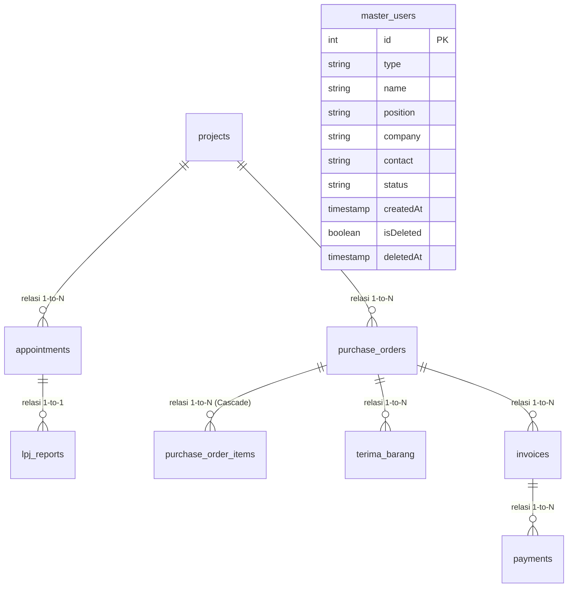
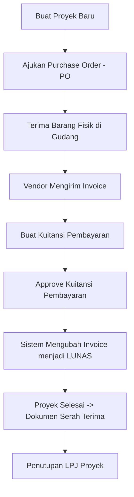

# Dokumentasi Teknis Sistem DMSK (Document Management System & Keuangan)

Dokumentasi teknis ini menjelaskan spesifikasi arsitektur, teknologi, skema database, spesifikasi API, struktur berkas, alur program, fungsi-fungsi penting, serta panduan instalasi dari sistem aplikasi DMSK.

---

## 1. Teknologi yang Digunakan (Tech Stack)

Aplikasi DMSK dirancang dengan arsitektur **Client-Server** yang memisahkan modul antarmuka pengguna (Frontend) dengan server pengolah logika dan database (Backend).

### Frontend (Client-Side)
*   **React (v19)**: Library Javascript utama untuk membangun antarmuka pengguna (UI) yang reaktif berbasis komponen.
*   **Vite**: Alat pengembangan frontend (*build tool*) yang super cepat untuk mendukung pengerjaan lokal dan bundel produksi.
*   **Vanilla CSS**: Digunakan untuk gaya UI kustom penuh, memberikan fleksibilitas performa visual yang premium.
*   **React Router Dom (v7)**: Mengatur routing halaman (*Single Page Application*).
*   **Recharts**: Library visualisasi grafik di dashboard keuangan dan proyek.
*   **Lucide React**: Paket ikon berbasis SVG yang elegan dan responsif.
*   **Date-fns**: Digunakan untuk manipulasi dan format tanggal.

### Backend (Server-Side)
*   **Node.js**: Runtime Javascript di sisi server.
*   **Express.js**: Framework minimalis untuk membuat API web (RESTful API).
*   **CORS**: Middleware untuk mengizinkan pertukaran resource lintas domain antara frontend (port 5173) dan backend (port 5000).
*   **Dotenv**: Mengelola konfigurasi kredensial database melalui variabel lingkungan (.env).

### Database (Data-Store)
*   **MySQL**: Relational Database Management System (RDBMS) untuk menyimpan data terstruktur.
*   **mysql2/promise**: Driver koneksi MySQL untuk Node.js yang mendukung operasi *async/await* (Promise-based).

---

## 2. Arsitektur Sistem

Sistem ini menggunakan arsitektur **3-Tier Architecture** (Presentation Tier, Application Tier, and Data Tier) untuk menjamin pemisahan tanggung jawab yang jelas (*Separation of Concerns*).

```mermaid
graph LR
    subgraph Presentation Tier (Client)
        React[React Frontend App]
        Context[AppDataContext]
    end

    subgraph Application Tier (Server)
        Express[Express.js Server]
        Routes[REST API Routes]
    end

    subgraph Data Tier (Database)
        MySQL[(MySQL Database)]
    end

    React -->|Interaksi User| Context
    Context -->|HTTP / fetch| Routes
    Routes -->|Kueri SQL| MySQL
    MySQL -->|Kembalikan Baris| Routes
    Routes -->|Response JSON| Context
    Context -->|Update State| React
```

### Penjelasan Alur Komunikasi:
1.  **Client-side Request**: Pengguna memicu aksi di UI (misalnya, menambah proyek). Komponen memicu fungsi pada `AppDataContext` yang kemudian mengirimkan HTTP request (`fetch`) berupa payload JSON ke server backend.
2.  **Server-side Processing**: Express Server menerima request di endpoint yang sesuai (contoh: `POST /api/projects`). Controller mengekstrak payload, memvalidasi data, dan melakukan kueri SQL menggunakan pool koneksi `mysql2`.
3.  **Database Transaction**: MySQL Server memproses kueri SQL (INSERT, SELECT, UPDATE, DELETE) dan mengembalikan status atau baris data ke backend.
4.  **Client-side State Sync**: Backend mengirimkan respons berformat JSON ke frontend. Frontend (`AppDataContext`) memperbarui state React lokal secara instan dengan data baru yang memiliki ID auto-increment dari database, sehingga UI diperbarui tanpa perlu memuat ulang seluruh halaman (*no full-page reload*).

---

## 3. Struktur Database (ERD & Skema)

Database terdiri dari 9 tabel yang terintegrasi melalui relasi *Foreign Key* (FK) untuk menjamin konsistensi dan integritas data logistik serta keuangan.

### Entity Relationship Diagram (ERD)



### Skema Tabel Lengkap

#### 1. Tabel `projects` (Data Proyek)
Menyimpan data utama proyek konstruksi.
| Nama Kolom | Tipe Data | Atribut | Deskripsi |
| :--- | :--- | :--- | :--- |
| `id` | INT | PK, Auto Increment | ID Unik Proyek |
| `code` | VARCHAR(255) | NOT NULL | Kode urut proyek (Contoh: `PR/001/Gedung Pusat/2026`) |
| `name` | VARCHAR(255) | NOT NULL | Nama proyek |
| `type` | VARCHAR(100) | | Kategori proyek (Gedung, Rumah, Jembatan, Renovasi, dll.) |
| `location`| VARCHAR(255) | | Lokasi wilayah proyek |
| `startDate`| DATE | | Tanggal proyek dimulai |
| `endDate` | DATE | | Tanggal target selesai proyek |
| `status` | VARCHAR(50) | | Status proyek (`Active` / `Inactive`) |
| `details` | TEXT | | Deskripsi kebutuhan proyek |
| `owner` | VARCHAR(255) | | Pemilik proyek |
| `createdAt`| TIMESTAMP | DEFAULT NOW()| Waktu pembuatan record |
| `accessMode`| VARCHAR(100) | | Tingkat akses berkas |
| `fileType` | VARCHAR(50) | | Format dokumen cetak (PDF) |
| `fileSize` | VARCHAR(50) | | Perkiraan ukuran berkas dokumen |
| `pic` | VARCHAR(255) | | Nama & Jabatan PIC yang ditunjuk dari daftar master user |
| `isDeleted`| BOOLEAN | DEFAULT FALSE | Status penghapusan (*soft delete*) |
| `deletedAt`| TIMESTAMP | NULL | Waktu record di-soft delete |

#### 2. Tabel `appointments` (Serah Terima / ST)
Mencatat berita acara serah terima pekerjaan proyek kepada kontraktor atau sub-kontraktor.
| Nama Kolom | Tipe Data | Atribut | Deskripsi |
| :--- | :--- | :--- | :--- |
| `id` | INT | PK, Auto Increment | ID Serah Terima |
| `code` | VARCHAR(255) | NOT NULL | Kode Berita Acara ST |
| `projectId`| INT | FK -> `projects.id` | Keterkaitan dengan proyek tertentu |
| `mainCon` | VARCHAR(255) | | Pihak Kontraktor Utama |
| `subCon` | VARCHAR(255) | | Pihak Sub-Kontraktor |
| `vendor` | VARCHAR(255) | | Pihak Vendor penyedia |
| `date` | DATE | | Tanggal serah terima ditandatangani |
| `isDeleted`| BOOLEAN | DEFAULT FALSE | Status *soft delete* |

#### 3. Tabel `purchase_orders` (PO Header)
Mencatat pemesanan material dari proyek ke vendor.
| Nama Kolom | Tipe Data | Atribut | Deskripsi |
| :--- | :--- | :--- | :--- |
| `id` | INT | PK, Auto Increment | ID PO |
| `code` | VARCHAR(255) | NOT NULL | Kode Dokumen PO |
| `projectId`| INT | FK -> `projects.id` | Proyek terkait |
| `vendor` | VARCHAR(255) | | Nama Vendor tujuan pemesanan |
| `date` | DATE | | Tanggal pengajuan PO |
| `total` | DECIMAL(15, 2)| | Total nominal nilai barang |
| `status` | VARCHAR(50) | | Status persetujuan (`Pending`, `Approved`, `Rejected`) |

#### 4. Tabel `purchase_order_items` (PO Items)
Mencatat detail material yang dipesan di dalam PO (Relasi One-to-Many).
| Nama Kolom | Tipe Data | Atribut | Deskripsi |
| :--- | :--- | :--- | :--- |
| `id` | INT | PK, Auto Increment | ID Item |
| `poId` | INT | FK -> `purchase_orders.id` | Terikat ke PO induk (Cascade Delete) |
| `name` | VARCHAR(255) | NOT NULL | Nama barang/material (contoh: Semen, Besi) |
| `qty` | INT | NOT NULL | Jumlah barang |
| `price` | DECIMAL(15, 2)| NOT NULL | Harga satuan barang |

#### 5. Tabel `terima_barang` (Tanda Terima Gudang)
Logistik penerimaan barang di gudang.
| Nama Kolom | Tipe Data | Atribut | Deskripsi |
| :--- | :--- | :--- | :--- |
| `id` | INT | PK, Auto Increment | ID Penerimaan |
| `code` | VARCHAR(255) | NOT NULL | Kode terima barang (TB) |
| `poId` | INT | FK -> `purchase_orders.id` | PO referensi penerimaan |
| `vendor` | VARCHAR(255) | | Nama vendor pengirim |
| `date` | DATE | | Tanggal barang diterima |
| `pic` | VARCHAR(255) | | Petugas gudang yang menerima |

#### 6. Tabel `lpj_reports` (Laporan LPJ)
Laporan pertanggungjawaban penutupan proyek.
| Nama Kolom | Tipe Data | Atribut | Deskripsi |
| :--- | :--- | :--- | :--- |
| `id` | INT | PK, Auto Increment | ID LPJ |
| `code` | VARCHAR(255) | NOT NULL | Kode laporan LPJ |
| `appointmentId`| INT | FK -> `appointments.id`| Referensi Serah Terima terkait |
| `projectName`| VARCHAR(255)| | Nama proyek terkait |
| `closingReportDate`| DATE | | Tanggal penutupan laporan |

#### 7. Tabel `invoices` (Tagihan Vendor)
Mencatat invoice yang dikeluarkan vendor atas PO yang telah disetujui.
| Nama Kolom | Tipe Data | Atribut | Deskripsi |
| :--- | :--- | :--- | :--- |
| `id` | INT | PK, Auto Increment | ID Invoice |
| `code` | VARCHAR(255) | NOT NULL | Kode Invoice |
| `poId` | INT | FK -> `purchase_orders.id` | PO referensi tagihan |
| `vendor` | VARCHAR(255) | | Vendor penagih |
| `date` | DATE | | Tanggal cetak invoice |
| `amount` | DECIMAL(15, 2)| | Nominal tagihan |
| `status` | VARCHAR(50) | | Status tagihan (`Unpaid`, `Paid`) |

#### 8. Tabel `payments` (Kuitansi Pembayaran)
Mencatat kuitansi realisasi transfer pembayaran tagihan invoice.
| Nama Kolom | Tipe Data | Atribut | Deskripsi |
| :--- | :--- | :--- | :--- |
| `id` | INT | PK, Auto Increment | ID Kuitansi |
| `code` | VARCHAR(255) | NOT NULL | Kode Kuitansi (KWT) |
| `invoiceId`| INT | FK -> `invoices.id` | Invoice referensi pembayaran |
| `amount` | DECIMAL(15, 2)| | Nominal bayar |
| `method` | VARCHAR(100) | | Metode pembayaran (Transfer, Tunai) |
| `status` | VARCHAR(50) | | Status approval bayar (`Pending`, `Approved`, `Rejected`) |

---

## 4. Spesifikasi API Endpoint

Seluruh API menggunakan JSON sebagai format pertukaran data. Server berjalan secara default pada: `http://localhost:5000`.

### A. Projects (Data Proyek)
*   **`GET /api/projects`**
    *   **Deskripsi**: Mengambil seluruh data proyek (termasuk yang di-softdelete).
    *   **Response (200 OK)**:
        ```json
        [
          {
            "id": 1,
            "code": "PR/001/Gedung Pusat/2026",
            "name": "Gedung Pusat",
            "type": "Gedung",
            "location": "Jakarta",
            "startDate": "2026-01-10",
            "endDate": "2026-12-31",
            "status": "Active",
            "pic": "Budi Wirawan (Direktur PT. WKP)",
            "isDeleted": false,
            "deletedAt": null
          }
        ]
        ```

*   **`POST /api/projects`**
    *   **Deskripsi**: Menyimpan proyek baru ke database.
    *   **Request Body**:
        ```json
        {
          "code": "PR/003/Apartment Tidar/2026",
          "name": "Apartment Tidar",
          "type": "Gedung",
          "location": "Malang",
          "startDate": "2026-06-01",
          "endDate": "2027-06-01",
          "status": "Active",
          "details": "Pembangunan unit apartemen",
          "owner": "System Administrator",
          "accessMode": "Full Access",
          "fileType": "PDF",
          "fileSize": "1.8 MB",
          "pic": "Anto Susilo (Manajer PT. WKP)"
        }
        ```
    *   **Response (201 Created)**: Mengembalikan objek proyek yang telah berhasil disimpan lengkap dengan ID database-nya.

*   **`DELETE /api/projects/:id`**
    *   **Deskripsi**: Melakukan soft delete proyek (mengubah flag `isDeleted = true`).

*   **`PUT /api/projects/restore/:id`**
    *   **Deskripsi**: Memulihkan proyek dari tempat sampah (mengubah flag `isDeleted = false`).

### B. Purchase Orders (PO)
*   **`GET /api/purchase-orders`**
    *   **Deskripsi**: Mengambil daftar PO lengkap dengan item material di dalamnya (Nested Array).
    *   **Response (200 OK)**:
        ```json
        [
          {
            "id": 1,
            "code": "PO/PT. WKP/2026/02/001",
            "projectId": 1,
            "vendor": "Mandiri Steel",
            "total": 150000000.00,
            "status": "Approved",
            "isDeleted": false,
            "items": [
              { "name": "Semen", "qty": 1000, "price": 60000 },
              { "name": "Besi Beton", "qty": 500, "price": 180000 }
            ]
          }
        ]
        ```

*   **`POST /api/purchase-orders`**
    *   **Deskripsi**: Menyimpan PO baru beserta item-itemnya sekaligus (Bulk transaction).
    *   **Request Body**:
        ```json
        {
          "code": "PO/PT. WKP/2026/06/003",
          "projectId": 2,
          "vendor": "Semen Nusantara",
          "date": "2026-06-26",
          "total": 24000000,
          "status": "Pending",
          "owner": "System Administrator",
          "fileType": "PDF",
          "fileSize": "1.2 MB",
          "items": [
            { "name": "Semen Gresik", "qty": 400, "price": 60000 }
          ]
        }
        ```

*   **`PUT /api/purchase-orders/:id/approve`** & **`PUT /api/purchase-orders/:id/reject`**
    *   **Deskripsi**: Menyetujui atau menolak dokumen PO.

### C. Payments & Invoices (Keuangan)
*   **`POST /api/payments`**
    *   **Deskripsi**: Menyimpan bukti pembayaran baru. Jika status pembayaran bernilai `'Approved'`, backend akan otomatis memperbarui status Invoice terkait menjadi `'Paid'` (Lunas).
    *   **Request Body**:
        ```json
        {
          "code": "KWT/Mandiri Steel/2026/02/001",
          "invoiceId": 1,
          "vendor": "Mandiri Steel",
          "date": "2026-02-20",
          "amount": 150000000.00,
          "method": "Transfer",
          "status": "Approved"
        }
        ```

*   **`PUT /api/payments/:id/approve`**
    *   **Deskripsi**: Menyetujui kuitansi pembayaran tertunda dan mengubah status invoice terkait menjadi `'Paid'`.

---

## 5. Struktur Folder Proyek

```text
dmsk/
├── public/                 # Aset statis publik (favicon, index.html dll)
├── dist/                   # Hasil kompilasi siap produksi (setelah npm run build)
├── server/                 # KODE BACKEND API (Node.js/Express)
│   ├── .env                # Kredensial & konfigurasi database MySQL (diabaikan git)
│   ├── .env.example        # Template konfigurasi variabel lingkungan (.env)
│   ├── db.js               # Pengaturan pool koneksi mysql2/promise
│   ├── index.js            # Entrypoint API server & definisi route REST
│   ├── schema.sql          # Script SQL pembuatan skema & inisialisasi data
│   └── package.json        # Paket & dependensi backend (CORS, Express, MySQL2, dll)
├── src/                    # KODE FRONTEND (React 19)
│   ├── assets/             # Aset gambar & ilustrasi UI lokal
│   ├── components/         # Komponen global (Sidebar, Navbar, dll)
│   │   └── previews/       # Komponen visual preview dokumen (PDF style preview)
│   │       ├── ProjectPreview.jsx
│   │       ├── STPreview.jsx
│   │       └── ...
│   ├── context/            # Pengaturan State Global React
│   │   └── AppDataContext.jsx # Penghubung frontend dengan MySQL API backend
│   ├── layouts/            # Tata letak halaman (AdminLayout.jsx)
│   ├── pages/              # Halaman-halaman fitur aplikasi (Dashboard, Proyek, dll)
│   │   ├── Dashboard.jsx
│   │   ├── DataProyek.jsx
│   │   └── ...
│   ├── utils/              # Fungsi pembantu format data & angka
│   ├── App.jsx             # Pengaturan routing utama React Router
│   ├── index.css           # Sistem desain gaya Vanilla CSS (warna, font, animasi)
│   └── main.jsx            # Rendering root DOM React ke HTML
├── package.json            # Paket & konfigurasi script frontend (Vite, React)
├── vite.config.js          # Konfigurasi bundler Vite
└── TECHNICAL_DOCUMENTATION.md # Dokumen teknis ini
```

---

## 6. Fungsi-Fungsi Penting (Function-level Logic)

Berikut adalah fungsi-fungsi inti yang mengatur jalannya program DMSK:

### A. Frontend (pada [AppDataContext.jsx](file:///e:/dmsk%2029-4-26/src/context/AppDataContext.jsx))
1.  `fetchAllData()` (Async):
    *   **Kegunaan**: Mengambil seluruh data dari database MySQL melalui API endpoints secara paralel menggunakan `Promise.all`.
    *   **Error Handling**: Jika server API mati atau MySQL XAMPP belum aktif, fungsi ini akan menangkap *exception* dan mengaktifkan tampilan error visual.
2.  `addProject(data)` & `addPO(data)` (Async):
    *   **Kegunaan**: Menghitung kode penomoran otomatis secara urut berdasarkan tahun/bulan aktif, lalu mengirimkan payload data ke database backend via POST API.
3.  `softDelete(type, id)` & `restoreItem(type, id)` (Async):
    *   **Kegunaan**: Mengirim permintaan DELETE atau PUT restore ke server untuk merubah status bendera `isDeleted` menjadi `true`/`false`.
4.  `setPaymentsWithMetadata(newPayments)` (Async Interceptor):
    *   **Kegunaan**: Fungsi kustom pembungkus state yang bertindak sebagai pencegat (*interceptor*). Ketika pembayaran baru disimpan, ia akan memicu request POST ke server MySQL dan secara otomatis merubah status invoice terkait menjadi `Paid` secara *real-time*.

### B. Backend (pada [index.js](file:///e:/dmsk%2029-4-26/server/index.js))
1.  `formatRow(row)`:
    *   **Kegunaan**: Memetakan ulang objek baris database MySQL. Karena MySQL menyimpan tipe boolean sebagai `TINYINT(1)` (nilai 0/1), fungsi ini merubah nilai 0/1 tersebut kembali menjadi tipe data boolean Javascript (`true` / `false`) agar kompatibel dengan logika frontend React.
2.  `POST /api/purchase-orders` (Transaction handler):
    *   **Kegunaan**: Menyimpan data header PO ke tabel `purchase_orders`, mendapatkan `insertId`, lalu memasukkan array material barang ke tabel `purchase_order_items` menggunakan skema kueri *bulk insert* dalam satu alur request.
3.  `PUT /api/payments/:id/approve`:
    *   **Kegunaan**: Menyetujui kuitansi pembayaran dan secara otomatis mengeksekusi kueri `UPDATE invoices SET status = 'Paid'` menggunakan relasi `invoiceId` yang terikat.

---

## 7. Alur Program (Program Flow)

### A. Siklus Dokumen Pengadaan dan Keuangan
Diagram berikut menunjukkan alur hidup dokumen, mulai dari pembuatan proyek hingga realisasi pembayaran:



### B. Alur Logika Pemulihan Data (Soft Delete & Trash Bin)
1.  Pengguna menekan tombol **Hapus** pada dokumen proyek/PO/lainnya di halaman dashboard atau data tabel.
2.  Aplikasi mengirim request `DELETE` ke backend API.
3.  Backend mengeksekusi kueri MySQL:
    `UPDATE [nama_tabel] SET isDeleted = 1, deletedAt = NOW() WHERE id = [id]`
4.  Di halaman utama, data tersebut disaring menggunakan `.filter(item => !item.isDeleted)` sehingga tidak lagi terlihat oleh pengguna umum.
5.  Data yang terhapus dipindahkan ke menu **Trash Bin / Restore**. Di halaman ini, pengguna dapat memulihkannya dengan memicu endpoint `/restore/:id` yang merubah status `isDeleted` kembali menjadi `0`.

---

## 8. Fitur Unggulan Sistem (Key Features)

1.  **Pencegahan Inkonsistensi Data (Cascading State)**:
    Ketika Anda menyetujui (Approve) pembayaran di menu approval kuitansi, sistem backend secara otomatis melacak invoice mana yang sedang dibayar dan merubah status invoice tersebut menjadi **Paid (Lunas)** secara instan.
2.  **Sistem Auto-Numbering Dokumen Cerdas**:
    Setiap dokumen (PO, Invoice, Serah Terima, LPJ, Terima Barang) secara otomatis dihitung nomor serinya oleh sistem berdasarkan singkatan nama vendor, bulan, dan tahun aktif saat ini. Menghindari duplikasi kode dokumen akibat kesalahan ketik (*human error*).
3.  **Toleransi Gangguan Jaringan (Offline Warning Screen)**:
    Jika MySQL server (XAMPP) mati di tengah pemakaian, frontend React tidak akan crash atau menampilkan halaman blank putih. Sistem akan menampilkan layar peringatan merah yang intuitif lengkap dengan petunjuk langkah demi langkah bagi pengguna untuk menyalakan kembali MySQL XAMPP mereka.
4.  **Soft-Deletable Data Security**:
    Semua penghapusan data bersifat aman (*soft delete*). Record tidak pernah benar-benar hilang dari database MySQL melainkan hanya ditandai, sehingga admin dapat memulihkan kembali (*restore*) data yang tidak sengaja terhapus kapan saja.
5.  **Dinamisme PIC Tanda Tangan**:
    Tanda tangan pada dokumen Data Proyek dan Berita Acara Serah Terima tidak lagi berupa nama statis. Sistem secara dinamis memetakan siapa PIC proyek tersebut, mengambil nama dan jabatannya secara otomatis dari daftar `master_users`, lalu menampilkannya secara resmi di kolom tanda tangan dokumen cetak.

---

## 9. Panduan Instalasi & Deployment

Ikuti langkah-langkah di bawah ini untuk memasang dan menjalankan aplikasi DMSK di komputer baru dari awal.

### Prasyarat System:
1.  **Node.js** (Rekomendasi versi LTS 18 atau lebih baru).
2.  **XAMPP** (Untuk menjalankan Apache dan MySQL database).
3.  **Git** (Opsional, untuk melakukan clone repository).

---

### Langkah 1: Kloning / Dapatkan Proyek
Dapatkan folder proyek `dmsk` dan letakkan di direktori mana pun di komputer Anda (tidak harus ditaruh di dalam folder `htdocs` XAMPP).

---

### Langkah 2: Setup Database MySQL di XAMPP
1. Buka aplikasi **XAMPP Control Panel** di PC Anda.
2. Klik tombol **Start** pada modul **MySQL** (dan **Apache**).
3. Buka browser Anda dan akses **phpMyAdmin** di alamat:  
   [http://localhost/phpmyadmin/](http://localhost/phpmyadmin/)
4. Buat database baru:
   - Klik menu **New** di kolom sebelah kiri.
   - Masukkan nama database: `dmsk_db`
   - Klik tombol **Create**.
5. Import struktur tabel & data awal:
   - Klik database `dmsk_db` yang baru saja Anda buat.
   - Pilih tab **Import** pada menu bar atas.
   - Klik tombol **Choose File** (Pilih File) dan arahkan ke berkas berikut:  
     `[lokasi_proyek]/dmsk/server/schema.sql`
   - Gulir ke bawah halaman dan klik tombol **Import** (atau **Go**).
   - Tunggu hingga muncul notifikasi sukses berwarna hijau tanda seluruh tabel berhasil di-import.

---

### Langkah 3: Konfigurasi & Jalankan Backend API Server
1. Buka aplikasi terminal (Command Prompt / PowerShell / Git Bash).
2. Pindah ke direktori folder backend:
   ```bash
   cd "e:\dmsk 29-4-26\server"
   ```
3. Install dependensi modul backend:
   ```bash
   npm install
   ```
4. Buat berkas konfigurasi variabel lingkungan:
   *   Salin berkas `.env.example` dan ubah namanya menjadi `.env`.
   *   Secara default, berkas `.env` sudah diatur untuk kredensial XAMPP lokal:
       ```env
       PORT=5000
       DB_HOST=localhost
       DB_USER=root
       DB_PASSWORD=
       DB_NAME=dmsk_db
       DB_PORT=3306
       ```
5. Jalankan backend server:
   ```bash
   npm start
   ```
   *Jika sukses, akan muncul pesan di terminal Anda:*
   `Backend server is running on http://localhost:5000`  
   `Successfully connected to MySQL database: dmsk_db`

---

### Langkah 4: Jalankan Frontend React App
1. Buka terminal baru (biarkan terminal backend di Langkah 3 tetap berjalan).
2. Pindah ke folder root utama proyek:
   ```bash
   cd "e:\dmsk 29-4-26"
   ```
3. Install dependensi modul frontend:
   ```bash
   npm install
   ```
4. Jalankan server pengembangan Vite:
   ```bash
   npm run dev
   ```
5. Terminal akan menampilkan tautan lokal. Buka browser Anda dan akses halaman:  
   [http://localhost:5173/dmsk/](http://localhost:5173/dmsk/)

Aplikasi kini telah siap digunakan dan terhubung sepenuhnya ke database MySQL XAMPP Anda!
